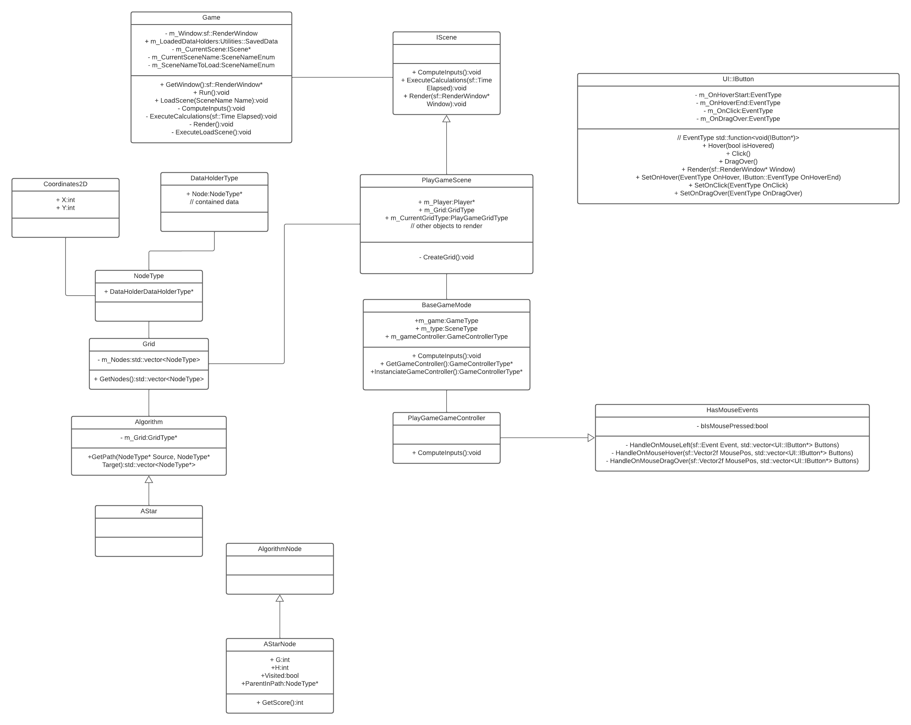

# Pathfinding project
Pierre Bouffartigues, Enzo Guilmer, Louna Tabbara

## Installation

This project uses [vcpkg](https://vcpkg.io/en/index.html) with a CMake file.

```bash
# install sfml package with vcpkg
vcpkg install sfml
# build the project
cmake -B build -S . -DCMAKE_TOOLCHAIN_FILE=<path_to_vcpkg_installation>\vcpkg\scripts\buildsystems\vcpkg.cmake
```

## Installation without vcpkg
```
# Add these two lines in the CMakeLists.txt on line 61 :
set(SFML_ROOT "<path_to_sfml_directory>")
set(SFML_STATIC_LIBRARIES TRUE)
```
### IDE configuration

**CLion:** Add `-DCMAKE_TOOLCHAIN_FILE=<path_to_vcpkg_installation>\vcpkg\scripts\buildsystems\vcpkg.cmake` to your CMake Settings > CMake options.

## UML

On [LucidChart](https://lucid.app/lucidchart/13253678-6cad-41f2-a8b5-d1f14714ccde/edit?viewport_loc=-279%2C45%2C4731%2C2468%2C0_0&invitationId=inv_18f8b622-5629-4cfa-b8cf-93794d68cdbe)



It is only a base to explain the overall functioning. Most of the classes are templated, and not all classes are listed.